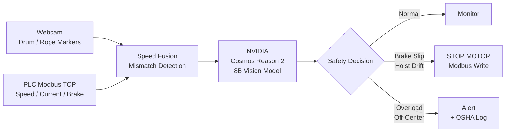

<div align="center">

# FactoryLM
### Physical AI Safety System for Overhead Cranes & Hoists

*The AI maintenance technician for the $5.7B overhead crane industry*

[](https://python.org)
[](https://build.nvidia.com/nvidia/cosmos-reason2-8b)
[](https://pymodbus.readthedocs.io)
[](https://www.osha.gov/laws-regs/regulations/standardnumber/1910/1910.179)
[](https://github.com/Mikecranesync/factorylm-cosmos-cookoff)
[](https://luma.com/nvidia-cosmos-cookoff)

<!-- Add demo GIF here after filming -->
<!--  -->

[](YOUTUBE_LINK_HERE)

</div>

---

> Overhead crane failures cause catastrophic load drops, fatalities, and million-dollar shutdowns.
> Existing diagnostic tools cost $8,000/seat, have zero AI capability, and can't see what the
> camera sees. **FactoryLM fuses live PLC telemetry with NVIDIA Cosmos Reason 2 vision intelligence
> to detect hoist slip, brake fade, and speed mismatch before the load drops.**

## The Problem

- **Overhead cranes kill** — OSHA 1910.179 mandates daily-to-monthly inspections but provides no AI tooling
- **Drum speed sensors** are not required by ASME B30.2 or CMAA, meaning most cranes have **no brake slip detection**
- **Tier-1 crane OEMs** (Konecranes CraneBrain, Demag SmartFunctions) charge enterprise rates for features a maintenance tech could build with a webcam
- The crane predictive maintenance market is **$184M and growing at 9.81% CAGR** — almost entirely owned by proprietary OEM software

## What FactoryLM Does



**The closed loop:** Cosmos R2 watches tape markers on the hoist drum. It compares visual rope speed to the VFD commanded speed over Modbus TCP. If the brake is slipping — rope moving while motor is stopped — it writes Coil 0 to trigger an emergency stop. **This is the AI safety decision running in under 2 seconds on real hardware.**

## Fault Detection Capability

| Fault | How Detected | OSHA 1910.179 Ref | Action |
|---|---|---|---|
| **Hoist brake slip** | Visual drum speed > 0 while motor stopped | (f)(3) Brakes | Emergency stop |
| **Speed mismatch** | VFD commanded != visual rope speed | (f)(1) Hoisting | Reduce speed / alert |
| **Motor overload** | Current draw vs load register | (f)(1) Motors | Alert + log |
| **E-Stop failure** | Coil state mismatch after command | (g)(4) Limit switches | Critical alarm |
| **Drift / creep** | Motion detected with zero command | (f)(3) Brakes | Emergency stop |

## Quick Start (No Hardware Required)

```bash
git clone https://github.com/Mikecranesync/factorylm-cosmos-cookoff
cd factorylm-cosmos-cookoff
pip install -r requirements.txt

# Run AI diagnosis with simulated crane PLC — no hardware needed
python3 -m demo diagnose --mock

# Launch live dashboard
python3 -m uvicorn services.matrix.demo_ui:app --port 8080
open http://localhost:8080
```

## With Live Hardware

```bash
# Allen-Bradley Micro 820 at 192.168.1.100
python3 -m demo diagnose --live-plc 192.168.1.100

# Full dashboard with live tags + Cosmos R2 vision loop
python3 -m uvicorn services.matrix.app:app --port 8100 &
python3 -m uvicorn services.matrix.demo_ui:app --port 8080 &
```

## Hardware Stack

| Component | Model | Role |
|---|---|---|
| PLC | Allen-Bradley Micro 820 | Motion control, fault registers, E-stop |
| VFD | AutomationDirect GS10 | Hoist/travel speed control |
| Vision | USB Webcam + tape markers | Drum speed, rope movement, visual inspection |
| Protocol | Modbus TCP :502 | Real-time tag reads at 5Hz, coil writes |
| AI Engine | NVIDIA Cosmos Reason 2 8B | Cross-modal vision + telemetry reasoning |
| Inference | vLLM on Vast.ai L40S | Sub-2-second diagnosis latency |

## Cosmos Cookoff — Judging Criteria

| Criterion | FactoryLM Answer |
|---|---|
| **Quality of Ideas** | Cross-modal fusion: webcam visual speed + live PLC telemetry analyzed simultaneously by Cosmos R2. First demo to close the loop — AI detects fault AND writes Modbus coil to stop hardware |
| **Technical Implementation** | `--mock` mode runs with zero hardware. 12 unit tests. Modular architecture. Reproducible in 3 commands. Full whitepaper + user manual included |
| **Design** | Live dashboard with SVG tachometer, fault injection buttons, Cosmos R2 chain-of-thought panel, MJPEG webcam feed, fault history timeline, full-screen demo mode |
| **Impact** | Targets $5.73B overhead crane market. Replaces $8,000/seat OEM tools. OSHA 1910.179 compliance data built in. Built by a maintenance technician, for maintenance technicians |

## Why Overhead Cranes

Your conveyor demo proves the concept. But overhead cranes are where this becomes **life-safety critical**:

- A conveyor jam costs time. **A hoist brake slip drops the load.**
- OSHA 1910.179 requires inspection documentation — FactoryLM generates it automatically
- No ASME standard requires drum speed sensors — FactoryLM adds that capability with a $15 webcam
- Every steel mill, shipyard, automotive plant, and warehouse has overhead cranes
- Konecranes and Demag charge enterprise rates. **FactoryLM is open source.**

## Architecture

```
factorylm-cosmos-cookoff/
├── demo/                    # Unified CLI — python -m demo <subcommand>
│   ├── __main__.py          # diagnose | dashboard | video-reel | test
│   ├── diagnosis_engine.py  # Cosmos R2 multimodal prompt + response parser
│   ├── speed_fusion.py      # Visual vs PLC speed mismatch detection
│   └── _paths.py            # PyInstaller-safe path resolution
├── cosmos/                  # Cosmos R2 API client + incident watcher
├── diagnosis/               # Rule-based fault classifier (12 fault codes)
├── services/matrix/         # FastAPI live dashboard (app.py + demo_ui.py)
├── video/                   # Clip ingestion → Cosmos scoring → highlight reel
└── config/                  # PLC tag maps, Modbus register layout
```

## Built By

**Industrial Maintenance Technologist** — Lake Wales, FL
GitHub: [@Mikecranesync](https://github.com/Mikecranesync)
Submission for [NVIDIA Cosmos Cookoff 2026](https://luma.com/nvidia-cosmos-cookoff)

---

<div align="center">
<sub>Powered by <strong>NVIDIA Cosmos Reason 2</strong> · Built for the people who keep factories running</sub>
</div>
